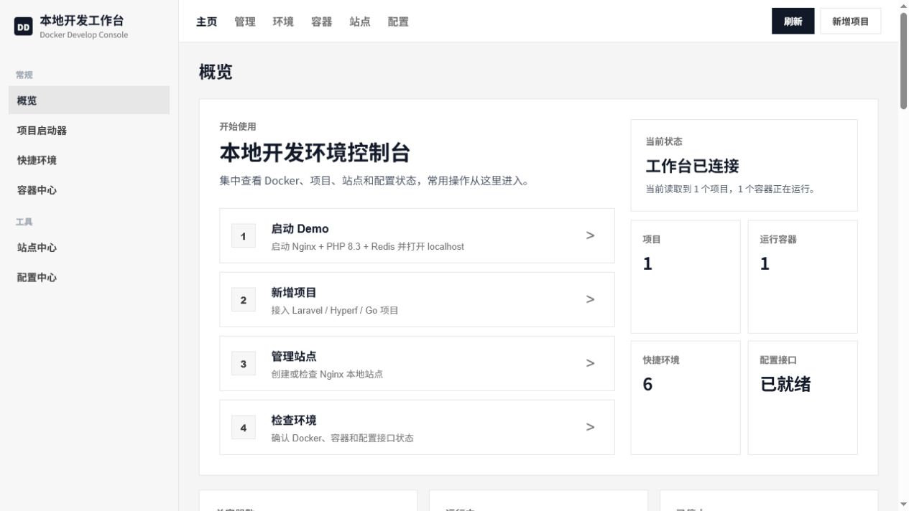
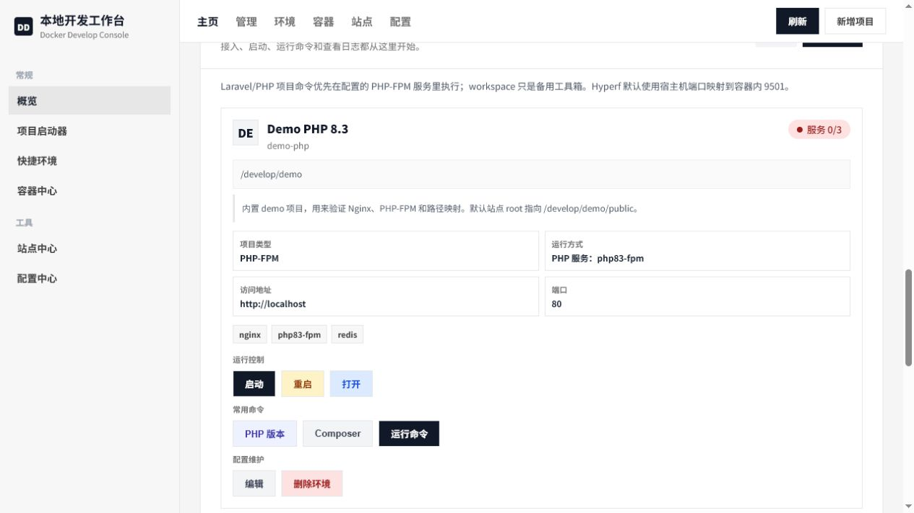
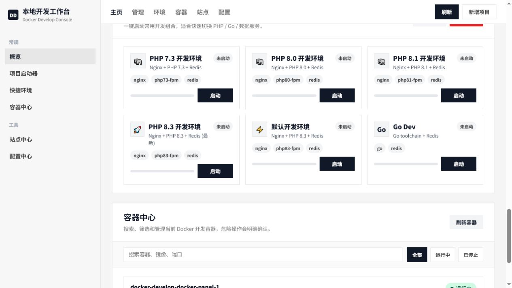
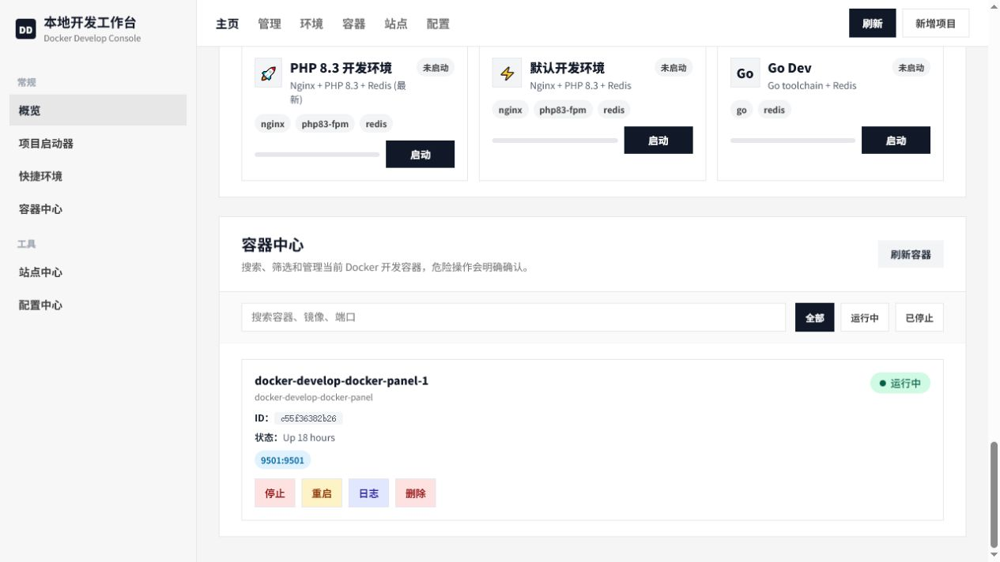

# Docker Develop 本地开发环境

Docker Develop 是一套面向团队本地开发的 Docker 工作台，用来统一管理 PHP/Laravel、Hyperf、Go、Nginx、Redis 和本地项目运行环境。

它的目标很直接：新成员拉下代码后，启动 Docker，然后执行一个命令就能打开面板、接入项目、启动服务和查看环境状态。默认配置已经面向国内开发网络做了优化，包括 PHP 8.3、Composer 阿里云源、Go Proxy，以及 Windows / WSL / macOS 三种本地运行方式。

当前 `docker-panel` 默认绑定到 `127.0.0.1:9501`，只给本机访问。面板可以操作 Docker 容器、Nginx 站点和配置文件，因此不建议暴露到局域网或公网。

## 项目截图

工作台首页集中展示 Docker 状态、项目数量、快捷入口和环境检查结果。



项目启动器用于接入 Laravel、Hyperf、Go 或普通 PHP 项目，并提供启动、重启、日志、命令执行和配置预览等常用操作。



快捷环境可以按需启动常见开发组合，例如 PHP 8.3、Nginx、Redis、Go 或完整 Web 环境。



容器中心用于查看当前开发容器状态，并执行刷新、启动、停止、重启、日志查看等操作。



## 当前架构

- `docker-panel`：本地 Web 面板，地址 `http://localhost:9501`，当前默认免登录。
- `nginx`：普通 Web 入口，适合 Laravel、ThinkPHP、普通 PHP-FPM、静态站点。
- `php-fpm` / `php73-fpm` / `php80-fpm` / `php81-fpm` / `php83-fpm`：多 PHP 版本运行环境。
- `hyperf-*`：Hyperf 项目专属容器，一个 Hyperf 项目一个常驻容器。
- `go`：Go 开发工具容器，用于 `go run`、`go test`、`go build`。
- `redis`：公共 Redis 服务。
- `workspace`：备用工具箱，只有需要通用 Composer、Node、诊断命令时再启动。

## 支持平台

这套环境默认支持三种本地运行方式：

- Windows Docker Desktop：在 PowerShell / CMD 中使用 `start-panel.bat` 和 `doctor.ps1`。
- WSL2：可以使用 Docker Desktop WSL 集成，也可以使用 WSL 内自己的 Docker Engine；在 WSL 终端中使用 `bash ./start-panel.sh` 和 `bash ./doctor.sh`。
- macOS Docker Desktop：在终端中使用 `bash ./start-panel.sh` 和 `bash ./doctor.sh`。

脚本会自动识别 `docker-compose` 或 `docker compose`。不同平台主要区别是 `.env` 里的 `HOST_PROJECT_PATH` 写法不同。

## 新用户快速启动

如果你是第一次拉这个仓库，先启动 Docker Desktop 或 Docker Engine，然后只执行一个启动命令。

Windows Docker Desktop：

```text
start-panel.bat
```

WSL / macOS：

```bash
bash ./start-panel.sh
```

启动脚本会自动完成首次初始化：复制或补全 `.env`、创建 `data` / `logs` 目录、统一 PHP 8.3、配置 Composer 阿里云源和 Go Proxy。默认会使用内置 Demo，对新用户来说不需要先手动配置 `.env`。

如果想提前指定自己的业务项目共同父目录，可以手动执行：

```powershell
# Windows
powershell -NoProfile -ExecutionPolicy Bypass -File .\scripts\init-env.ps1 -Force -HostProjectPath D:\Develop
```

```bash
# WSL / macOS
bash ./scripts/init-env.sh --force --host-project-path /mnt/d/Develop
```

初始化之后，启动脚本会继续运行对应的 doctor 诊断，检查 Docker、Compose、路径映射和 `docker-compose.yml`。

也可以先手动诊断。

Windows：

```powershell
.\doctor.ps1
.\doctor.ps1 -SkipPanelHttp
```

WSL / macOS：

```bash
bash ./doctor.sh
bash ./doctor.sh --skip-panel-http
```

或者在项目根目录执行：

```powershell
docker-compose up -d docker-panel
```

如果电脑只有 Docker Compose v2，也可以执行：

```powershell
docker compose up -d docker-panel
```

然后打开：

```text
http://localhost:9501
```

默认初始化会使用 `HOST_PROJECT_PATH=./data`，也就是仓库内置 Demo。接入自己的业务项目时，可以先用 `scripts/init-env` 指定项目共同父目录，也可以之后修改 `.env` 里的 `HOST_PROJECT_PATH`；Windows 常见写法是 `D:\Develop`，WSL 常见写法是 `/mnt/d/Develop` 或 `/home/you/Develop`，macOS 常见写法是 `/Users/you/Develop`。

如果你创建的是 Hyperf 项目，第一次点击启动时面板会自动构建项目镜像，然后继续启动。即使 `projects.json` 缺失，面板也会尝试从 `docker-compose.yml` 中带标记的 Hyperf 服务恢复项目卡片。构建会花一点时间，终端区域会持续显示等待提示。业务项目已经有 `composer.json` 但还没有 `vendor/autoload.php` 时，容器启动前会自动执行一次 `composer install`。

如果启动失败，先运行诊断脚本：

```powershell
# Windows
.\doctor.ps1

# WSL / macOS
bash ./doctor.sh
```

它会检查 Docker、Compose、Docker Socket、端口、`.env`、路径映射、Composer 源、Go Proxy 和 compose 配置。

网络不稳定或想提前构建时，也可以手动执行：

```powershell
docker-compose build 项目服务名
docker-compose up -d 项目服务名 redis docker-panel
```

如果 Docker Hub 拉取基础镜像很慢，可以在本机 `.env` 里把下面两个值改成自己的镜像代理地址，不需要改 Dockerfile：

```env
DOCKER_PANEL_PHP_IMAGE=php:8.3-cli-alpine
DOCKER_PANEL_COMPOSER_IMAGE=composer:2
```

后续再启动同一个项目时，会直接使用已经构建好的镜像。

## 首次使用

首次启动会自动准备本机 `.env`。如果只是打开面板或验证 Demo，可以一路回车使用默认配置。`projects.json` 是本机自动生成文件，不再作为固定配置提交。

当你要接入自己电脑上的业务项目时，可以先用初始化脚本指定项目共同父目录，也可以之后修改 `.env`：

```env
# Windows PowerShell / CMD
HOST_PROJECT_PATH=D:\Develop
CONTAINER_PROJECT_PATH=/develop

# WSL，项目在 Windows D 盘
HOST_PROJECT_PATH=/mnt/d/Develop
CONTAINER_PROJECT_PATH=/develop

# WSL，项目在 Linux 文件系统
HOST_PROJECT_PATH=/home/you/Develop
CONTAINER_PROJECT_PATH=/develop

# macOS
HOST_PROJECT_PATH=/Users/you/Develop
CONTAINER_PROJECT_PATH=/develop
```

`.env.example` 是配置模板；`.env` 是本机运行配置。目录、端口、密码都可以因人而异。

## 路径映射

`.env` 里控制宿主机路径和容器路径。这个配置是每台电脑自己的本地配置，不应该当成固定值提交给所有人：

```env
HOST_PROJECT_PATH=D:\Develop
CONTAINER_PROJECT_PATH=/develop
```

例如你的 Windows 项目在：

```text
D:\Develop\company\order-api
```

在容器里对应：

```text
/develop/company/order-api
```

如果同事的项目放在 `E:\Work`，他自己的 `.env` 就应该写：

```env
HOST_PROJECT_PATH=E:\Work
CONTAINER_PROJECT_PATH=/develop
```

如果在 WSL 终端里运行，同一个 Windows D 盘目录要写成：

```env
HOST_PROJECT_PATH=/mnt/d/Develop
CONTAINER_PROJECT_PATH=/develop
```

如果在 macOS 终端里运行，通常写成：

```env
HOST_PROJECT_PATH=/Users/you/Develop
CONTAINER_PROJECT_PATH=/develop
```

然后面板里建议直接填写转换后的 `/develop/xxx`。Windows PowerShell 里也可以填写 `E:\Work\xxx` 这种宿主机路径，面板会按 `.env` 映射转换。

面板、Nginx、Projects 里建议都填写容器内路径，例如 `/develop/...`。

如果创建项目时报错：

```text
Host path is outside HOST_PROJECT_PATH
```

说明你填写的 Windows 项目路径不在 `.env` 的 `HOST_PROJECT_PATH` 下面。解决方式二选一：

1. 把 `.env` 的 `HOST_PROJECT_PATH` 改成你的业务项目共同父目录。
2. 在面板里直接填写容器路径，例如 `/develop/company/order-api`。

改完 `.env` 后，如果面板已经启动，需要重启面板让新配置生效：

```powershell
docker-compose restart docker-panel
```

## 启动面板

先启动 Docker Desktop 或 Docker Engine，然后在项目根目录执行：

```powershell
docker-compose up -d docker-panel
```

也可以使用平台启动脚本：

```text
# Windows
start-panel.bat

# WSL / macOS
bash ./start-panel.sh
```

打开：

```text
http://localhost:9501
```

停止环境：

```text
# Windows
docker-compose down

# WSL / macOS
bash ./stop-panel.sh
```

当前面板默认免登录，打开后直接进入控制台。

## 首页能力

首页现在主要分为几块：

- `环境健康检查`：检查 Docker、面板、Nginx、Redis、Projects、Sites、本机配置、默认 PHP、网络源和配置中心状态。
- `Projects 项目启动器`：新增、启动、停止、重启、运行项目命令和删除项目环境。
- `快捷环境`：一键启动 PHP / Go 常用组合。
- `容器列表`：查看、启动、停止、重启、日志和删除容器。
- `站点中心`：创建和管理 Nginx 本地站点。
- `配置中心`：编辑、验证、备份和恢复面板配置文件。

## 内置 Demo

仓库带了一个最小 PHP-FPM 示例项目：

```text
data/demo/public/index.php
```

默认 Nginx 站点指向 `/develop/demo/public`。保留默认 `.env` 时，`./data` 会映射到容器 `/develop`。可以在首页点击 `启动 Demo`，也可以手动启动 PHP 8.3 环境后直接访问：

```text
http://localhost
```

这个 demo 只用于验证 Nginx、PHP-FPM 和路径映射是否跑通，不影响你接入自己的业务项目。

## 新增项目

推荐优先使用首页 `Projects 项目启动器` 的 `新增项目`。

新增项目有两种接入方式：

- `完整接入环境（推荐）`：写入项目卡片，并按类型生成 Nginx 或 docker-compose 环境配置。
- `仅添加管理卡片`：只保存 `projects.json` 里的项目卡片，适合环境已经手动配置好的项目。

不同类型的行为：

- Laravel / PHP-FPM：写入 `projects.json`、Nginx site、Nginx 端口映射。
- Static：写入 `projects.json`、Nginx site、Nginx 端口映射。
- Hyperf：写入 `projects.json`，并在 `docker-compose.yml` 中生成项目专属容器。

推荐流程：

1. 打开 `http://localhost:9501`。
2. 在 `Projects 项目启动器` 点击 `新增项目`。
3. 选择项目类型、接入方式、PHP 版本和服务。
4. 填写项目标识、项目路径、访问端口。
5. 先点 `预览配置`，确认会写入哪些环境配置。
6. 确认无误后点 `生成并保存`。

这个过程不会删除或修改项目源码。

命令行脚手架仍然保留：

```powershell
.\scaffold.bat
```

一行命令示例：

```powershell
.\scaffold.bat laravel -Key order-api -Name OrderApi -Path D:\Develop\company\order-api -Port 8002 -Php php83-fpm
```

## 站点中心

顶部点击 `站点` 打开 `Nginx 站点中心`。

站点中心用于管理 Nginx site，只操作环境配置，不操作业务项目源码。

创建站点时可以选择：

- `Laravel / PHP`：root 通常是项目的 `public` 目录。
- `Static 静态站点`：root 通常是静态文件目录本身。
- `普通 PHP`：root 是入口文件所在目录。

访问方式：

- `端口访问（推荐）`：例如 `http://localhost:8002`。
- `域名访问`：例如 `http://classmate.test`，需要写入本机 hosts。Windows 在 `C:\Windows\System32\drivers\etc\hosts`，WSL/macOS 在 `/etc/hosts`。

新增端口映射后需要重启 Nginx 容器；只改 Nginx site 时重载 Nginx 即可。

## 配置中心

顶部点击 `配置` 打开 `配置中心`。

配置中心按分组管理：

- 核心配置：`docker-compose.yml`、`.env`、`Makefile`
- 项目配置：`projects.example.json`、`PROJECTS.md`、自动生成的 `projects.json`
- Nginx 配置：`nginx.conf`、`services/nginx/sites/*.conf`
- PHP 配置：各版本 `php.ini`、`opcache.ini`、`xdebug.ini`
- Redis 配置：`redis.conf`

保存配置前会自动备份。配置中心支持备份列表、恢复备份和按文件类型验证。新增后端控制器后需要重启 `docker-panel` 才会加载新接口。`/api/projects` 会在缺少或漏配项目卡片时，从 `projects.example.json` 和 `docker-compose.yml` 的 Hyperf 标记块自动补回项目配置。

## Laravel / 普通 PHP 项目

普通 Web 项目共用 `nginx + php-fpm + redis`。

PHP 8.3 示例：

```powershell
docker-compose up -d nginx php83-fpm redis docker-panel
```

PHP 8.1 示例：

```powershell
docker-compose up -d nginx php81-fpm redis docker-panel
```

Nginx site 的根目录通常指向 `public`：

```text
/develop/company/order-api/public
```

Projects 卡片的工作目录则填写项目根目录：

```text
/develop/company/order-api
```

访问示例：

```text
http://localhost:8002
```

## Hyperf 项目

Hyperf 项目建议一个项目一个容器，不和 Laravel/PHP-FPM 共用常驻进程容器。

面板和脚手架为 Hyperf 项目生成的默认启动命令适合本地开发：

```bash
if php bin/hyperf.php list 2>/dev/null | grep -q "server:watch"; then php bin/hyperf.php server:watch; else php bin/hyperf.php start; fi
```

也就是说：

- 项目安装了 `hyperf/watcher` 时，默认使用 `server:watch`，修改 `app`、`config` 等文件后会自动重启。
- 项目没有安装 watcher 时，自动回退到 `php bin/hyperf.php start`，不会因为缺少热更新组件而启动失败。
- 项目有 `composer.json` 但没有 `vendor/autoload.php` 时，启动容器会先自动执行 `composer install`。
- 生成的容器命令会先执行 `git config --global --add safe.directory "$PWD"`，避免 Windows 挂载目录触发 Git ownership 警告。

容器端口规则：

```text
容器内监听：0.0.0.0:9501
宿主机访问：localhost:9502
端口映射：9502:9501
```

如果想用命令行启动某个已经通过面板生成的 Hyperf 项目，可以使用它的服务名：

```powershell
docker-compose build hyperf-your-project
docker-compose up -d hyperf-your-project redis docker-panel
```

如果访问不到，优先检查 Hyperf 是否监听 `0.0.0.0:9501`，不要只监听 `127.0.0.1`。

Hyperf/Swoole 容器默认关闭 Xdebug。Xdebug 和 Swoole 同时启用时可能导致 worker signal=11 崩溃，所以 Hyperf 专属容器的 compose 配置会设置 `XDEBUG_MODE=off`，并建议 `WORKSPACE_INSTALL_XDEBUG=false`。

## Go 开发环境

Go 环境由 `go` 服务提供，默认配置在 `.env`：

```env
GO_VERSION=1.25
GOPROXY=https://goproxy.cn,direct
GO_HOST_PORT=8081
GO_DEBUG_PORT=2345
GO_CGO_ENABLED=1
GO_INSTALL_DELVE=false
```

第一次使用先构建：

```powershell
docker-compose build go
```

启动 Go 开发环境：

```powershell
docker-compose up -d go redis docker-panel
```

查看版本：

```powershell
docker-compose exec go go version
```

进入容器：

```powershell
docker-compose exec go sh
```

在某个 Go 项目里执行命令：

```powershell
docker-compose exec -w /develop/path/to/go-project go go mod tidy
docker-compose exec -w /develop/path/to/go-project go go test ./...
docker-compose exec -w /develop/path/to/go-project go go run .
```

如果你的 Go Web 服务监听容器内 `8080`，宿主机默认访问：

```text
http://localhost:8081
```

如果需要 Delve 调试器，把 `.env` 改成：

```env
GO_INSTALL_DELVE=true
```

然后重新构建：

```powershell
docker-compose build go
```

## workspace 的用途

`workspace` 现在不是主开发路径，只作为备用工具箱。

日常建议：

- Laravel / PHP：用对应 `php*-fpm` 容器执行项目命令。
- Hyperf：用项目自己的 `hyperf-*` 容器。
- Go：用 `go` 容器。
- workspace：只在需要一个临时通用工具箱时启动。

启动 workspace：

```powershell
docker-compose up -d workspace
```

## 删除项目环境

Projects 卡片里的 `Delete` 是环境清理，不删除项目源码。

Hyperf 项目默认可以清理：

- 专属 `hyperf-*` 容器。
- `docker-compose.yml` 中面板生成的 Hyperf service block。
- `projects.json` 项目记录。

Laravel/PHP/static 项目使用共享容器，不会删除 `nginx`、`php-fpm` 或 `redis`。可选清理：

- 备份并删除 `services/nginx/sites/<key>.conf`。
- 在确认没有其它项目或站点使用该端口时移除 Nginx 端口映射。
- 删除 `projects.json` 项目记录。

面板没有删除业务源码目录的 UI 或 API。

## 常用命令

下面命令示例默认使用 `docker-compose`。如果你的环境只有 Docker Compose v2，把命令里的 `docker-compose` 替换成 `docker compose` 即可。

WSL / macOS 也可以使用 Makefile：

```bash
make doctor
make start
make demo
make stop
```

查看面板状态：

```powershell
docker-compose ps docker-panel
```

查看所有服务：

```powershell
docker-compose ps
```

查看面板日志：

```powershell
docker-compose logs -f docker-panel
```

重启面板：

```powershell
docker-compose restart docker-panel
```

停止全部容器：

```powershell
docker-compose down
```

检查 compose 配置：

```powershell
docker-compose config
```

## 常见问题

### 面板打不开

先检查容器：

```powershell
docker-compose ps docker-panel
```

没有运行就启动：

```powershell
docker-compose up -d docker-panel
```

### 新站点访问不了

按顺序检查：

1. Nginx site 根目录是否是容器内路径。
2. 对应 PHP 容器是否启动。
3. 新增端口后是否重启过 Nginx 容器。
4. 端口是否已经写入 `docker-compose.yml` 的 `nginx.ports`。
5. 域名访问是否写入本机 hosts。

### Composer 报 dubious ownership

面板项目命令会自动执行 `git config --global --add safe.directory` 预处理。如果你手动进入容器执行命令，可以自己执行：

```bash
git config --global --add safe.directory /develop/your-project
```

### Go 依赖下载慢

默认使用：

```env
GOPROXY=https://goproxy.cn,direct
```

如果你想用官方代理，可以改成：

```env
GOPROXY=https://proxy.golang.org,direct
```

改完后重建 Go 容器。

## 安全提醒

当前面板为了本地开发方便，默认免登录。请只在本机使用，不要把 `9501` 暴露到公网或不可信局域网。

面板访问地址是：

```text
http://localhost:9501
```

`docker-compose.yml` 里的端口映射写成：

```yaml
127.0.0.1:9501:9501
```

它的含义是：只允许本机 `127.0.0.1` 访问，把宿主机的 `9501` 端口映射到容器内的 `9501` 端口。这样别人不能通过局域网 IP 直接访问你的本地面板。
